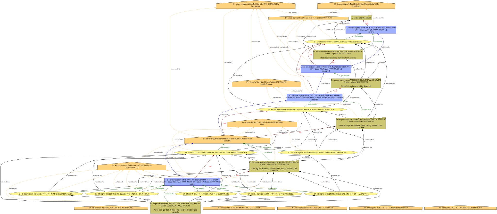
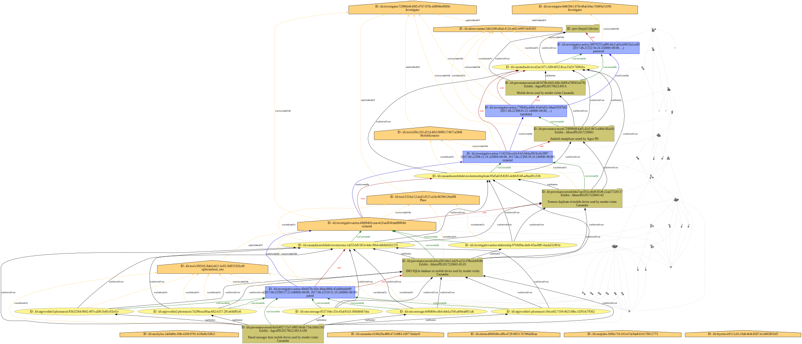
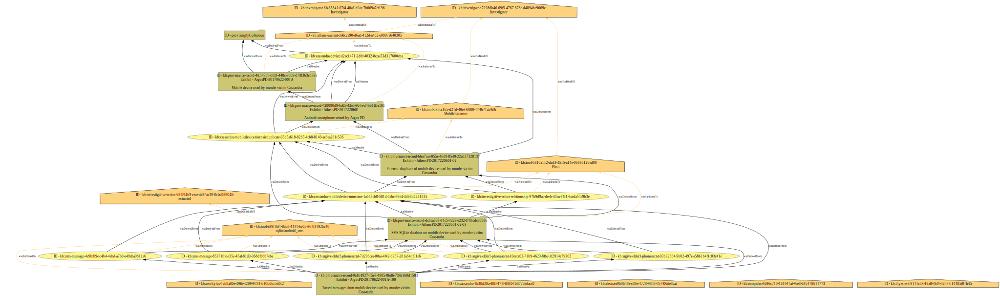

# Oresteia Example

This example was developed for the 2017 Digital Investigation paper to show
how CASE can represent multiple related criminal investigations. This
example refers to a trilogy of Greek tragedies written by Aeschylus in and
collectively called The Oresteia. For illustrative purposes, the characters
of these ancient stories are given access to modern technology.


## Investigations

These are the multiple investigations illustrated in this example (with SPARQL source `src/query-investgations.sparql`):

|    | ?nInvestigation                                                          | ?lName   | ?lDescription                                                                                                                                                                            |
|----|--------------------------------------------------------------------------|----------|------------------------------------------------------------------------------------------------------------------------------------------------------------------------------------------|
|  0 | http://example.org/kb/investigation-4586742a-710a-454f-bcb8-b60e230ec1b2 | Crime A  | In Mycenae, Atreus killed two sons of Thyestes, cooked them (except for their hands and heads), fed them to Thyestes, and then taunted Thyestes with his murdered sons' hands and heads. |
|  1 | http://example.org/kb/investigation-b05226da-eaef-4bc5-a139-ca12c94dbdfd | Crime B  | In Mycenae, Thyestes raped his daughter Pelopia to have a son (Aegisthus)                                                                                                                |
|  2 | http://example.org/kb/investigation-ac9fd560-261e-4cd6-af64-8b83d100b9a8 | Crime C  | In Mycenae, Aegisthus killed Atreus (Agamemnon's father)                                                                                                                                 |
|  3 | http://example.org/kb/investigation-2545442b-321c-454d-bcb8-c40d321ce2c2 | Crime D  | In Aulis, Agamemnon killed his daughter Iphigenia as a sacrifice to the gods                                                                                                             |
|  4 | http://example.org/kb/investigation-952d677d-6b62-4e53-9bac-1b113d268ac5 | Crime E  | In the Palace of Argos, Agamemnon and Cassandra were killed by Clytemnestra (accomplice Aegisthus)                                                                                       |
|  5 | http://example.org/kb/investigation-5aa33dc6-7a39-4731-a754-62a9c41e5220 | Crime F  | In the Palace of Argos, Clytemnestra and Aegisthus were killed by Orestes (accomplice Electra)                                                                                           |

<details>

<summary>SPARQL source - `query-investigations.sparql`</summary>

```sparql
PREFIX rdfs: <http://www.w3.org/2000/01/rdf-schema#>
PREFIX case-investigation: <https://ontology.caseontology.org/case/investigation/>
PREFIX uco-core: <https://ontology.unifiedcyberontology.org/uco/core/>
SELECT ?nInvestigation ?lName ?lDescription
WHERE {
  ?nInvestigation
    a/rdfs:subClassOf* case-investigation:Investigation ;
    .
  OPTIONAL {
    ?nInvestigation
      uco-core:name ?lName ;
      .
  }
  OPTIONAL {
    ?nInvestigation
      uco-core:description ?lDescription ;
      .
  }
}
ORDER BY ?lName
```

</details>


## People

These are the people mentioned throughout the graph:

|    | ?nPerson                                                                | ?lName       | ?lGivenName   | ?lFamilyName   |
|----|-------------------------------------------------------------------------|--------------|---------------|----------------|
|  0 | http://example.org/kb/aegisthus-c7da5045-ad5f-4f3d-8a74-a7fd46e9628d    | Aegisthus    |               |                |
|  1 | http://example.org/kb/aeschylus-1ab8a80e-39fb-4209-9781-b10bdbc5d0c2    |              | Aeschylus     | Bard           |
|  2 | http://example.org/kb/agamemnon-bf5ea2fe-a14b-4f13-9bd3-83063ff6397c    | Agamemnon    |               |                |
|  3 | http://example.org/kb/atreus-5c9fc0ba-251a-47c4-a1ec-b49ae7e3bce1       | Atreus       |               |                |
|  4 | http://example.org/kb/cassandra-1b38d28a-f88f-471f-8f83-16877dedacc0    |              | Cassandra     | Troy           |
|  5 | http://example.org/kb/clytemnestra-9e13b5c3-1f27-4035-981a-0ec9a1548006 | Clytemnestra |               |                |
|  6 | http://example.org/kb/electra-a960648e-c88e-4728-9853-7b7f06de8caa      |              | Electra       | Argos          |
|  7 | http://example.org/kb/eoghan-4ebb2f2c-ab97-4ea1-bc49-dc4496877848       |              |               |                |
|  8 | http://example.org/kb/euripides-3696c710-161f-47af-9ae8-61b178611773    |              | Euripides     | Forte          |
|  9 | http://example.org/kb/iphigenia-323bc6bc-d64b-42d1-a9f5-d4452efdbae6    | Iphigenia    |               |                |
| 10 | http://example.org/kb/orestes-5e400330-677d-42c1-8b32-2836cda219bf      | Orestes      |               |                |
| 11 | http://example.org/kb/pelopia-d4b29a40-998b-4660-b67e-2ebb9683893d      | Pelopia      |               |                |
| 12 | http://example.org/kb/person-82684209-0ee5-45d9-b873-125d2ca63919       | Joachim Metz |               |                |
| 13 | http://example.org/kb/thyestes-b9111c63-19a8-4bf4-8287-b14485f01b45     |              | Thyestes      | Mycenae        |
| 14 | http://example.org/kb/thyestes-son-2a869a9a-ab97-4fc9-95cf-63804fcf061f |              |               |                |
| 15 | http://example.org/kb/thyestes-son-e992bb12-2322-46e8-b8f4-5095a4767b14 |              |               |                |

<details>

<summary>SPARQL source - `query-people.sparql`</summary>

```sparql
PREFIX rdfs: <http://www.w3.org/2000/01/rdf-schema#>
PREFIX uco-core: <https://ontology.unifiedcyberontology.org/uco/core/>
PREFIX uco-identity: <https://ontology.unifiedcyberontology.org/uco/identity/>
SELECT ?nPerson ?lName ?lGivenName ?lFamilyName
WHERE {
  ?nPerson
    a/rdfs:subClassOf* uco-identity:Person ;
    .
  OPTIONAL {
    ?nPerson
      uco-core:name ?lName ;
      .
  }
  OPTIONAL {
    ?nPerson
      uco-core:hasFacet / uco-identity:familyName ?lFamilyName ;
      .
  }
  OPTIONAL {
    ?nPerson
      uco-core:hasFacet / uco-identity:givenName ?lGivenName ;
      .
  }
}
ORDER BY ?nPerson
```

</details>

These are the investigations in which the people are generically linked:

|    | ?lPersonName   | ?lInA   | ?lInB   | ?lInC   | ?lInD   | ?lInE   | ?lInF   |
|----|----------------|---------|---------|---------|---------|---------|---------|
|  0 |                | ✓       |         |         |         |         |         |
|  1 |                | ✓       |         |         |         |         |         |
|  2 | Aegisthus      |         | ✓       | ✓       |         | ✓       | ✓       |
|  3 | Aeschylus      |         |         |         |         | ✓       |         |
|  4 | Agamemnon      |         |         |         | ✓       | ✓       |         |
|  5 | Atreus         | ✓       |         | ✓       |         |         |         |
|  6 | Cassandra      |         |         |         |         | ✓       |         |
|  7 | Clytemnestra   |         |         |         |         | ✓       | ✓       |
|  8 | Electra        |         |         |         |         | ✓       | ✓       |
|  9 | Euripides      |         |         |         |         | ✓       |         |
| 10 | Iphigenia      |         |         |         | ✓       |         |         |
| 11 | Joachim Metz   |         |         |         |         |         |         |
| 12 | Orestes        |         |         |         |         |         | ✓       |
| 13 | Pelopia        |         | ✓       |         |         |         |         |
| 14 | Thyestes       | ✓       | ✓       |         |         | ✓       |         |

<details>

<summary>SPARQL source - `query-people-investigations`</summary>

```sparql
PREFIX kb: <http://example.org/kb/>
PREFIX rdfs: <http://www.w3.org/2000/01/rdf-schema#>
PREFIX case-investigation: <https://ontology.caseontology.org/case/investigation/>
PREFIX uco-core: <https://ontology.unifiedcyberontology.org/uco/core/>
PREFIX uco-identity: <https://ontology.unifiedcyberontology.org/uco/identity/>
SELECT ?lPersonName ?lInA ?lInB ?lInC ?lInD ?lInE ?lInF
WHERE {
  ?nPerson
    a/rdfs:subClassOf* uco-identity:Person ;
    .
  OPTIONAL {
    ?nPerson
      uco-core:name ?lName ;
      .
  }
  OPTIONAL {
    ?nPerson
      uco-core:hasFacet / uco-identity:givenName ?lGivenName ;
      .
  }
  BIND(COALESCE(?lGivenName, ?lName) AS ?lPersonName)

  OPTIONAL {
    kb:investigation-4586742a-710a-454f-bcb8-b60e230ec1b2 uco-core:object ?nPerson .
    BIND("✓" AS ?lInA)
  }

  OPTIONAL {
    kb:investigation-b05226da-eaef-4bc5-a139-ca12c94dbdfd uco-core:object ?nPerson .
    BIND("✓" AS ?lInB)
  }

  OPTIONAL {
    kb:investigation-ac9fd560-261e-4cd6-af64-8b83d100b9a8 uco-core:object ?nPerson .
    BIND("✓" AS ?lInC)
  }

  OPTIONAL {
    kb:investigation-2545442b-321c-454d-bcb8-c40d321ce2c2 uco-core:object ?nPerson .
    BIND("✓" AS ?lInD)
  }

  OPTIONAL {
    kb:investigation-952d677d-6b62-4e53-9bac-1b113d268ac5 uco-core:object ?nPerson .
    BIND("✓" AS ?lInE)
  }

  OPTIONAL {
    kb:investigation-5aa33dc6-7a39-4731-a754-62a9c41e5220 uco-core:object ?nPerson .
    BIND("✓" AS ?lInF)
  }
}
ORDER BY ?lPersonName
```

</details>


## Relationship illustrations

Using a proof-of-concept illustration system, a render of this scenario's `uco-core:Relationship` objects is available:


## Provenance illustrations

Following visual-design practices of [PROV-O](https://www.w3.org/TR/prov-o/), the following renders of this scenario's provenance are available:

| Figure's contents | Time hidden | Time displayed |
| --- | --- | --- |
| All |  |  |
| Chains of communication (activities) |  |  |
| Chains of delegation (agents) |  |  |
| Chains of derivation (entities) |  |  |
| Chains of communication and delegation |  |  |
| Chains of communication and derivation |  |  |
| Chains of delegation and derivation |  |  |
