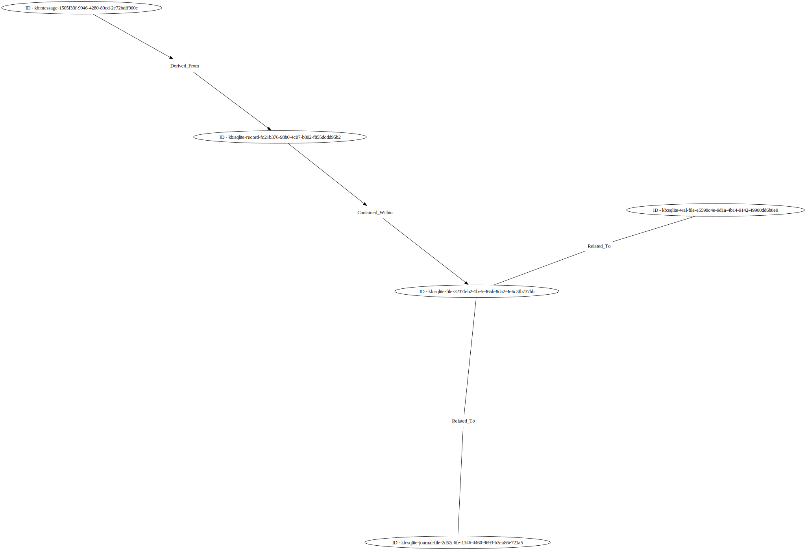

<!--
GENERATED FILE  README.md is generated from source files.  Edits to it will be overwritten by automated processes.:

If you need to edit its content, edit src/README.md.in, and then re-run `make` to re-build the file.
-->


# Database Record Representation

*A file containing all of the JSON-LD content within this page is here: [`database_records.json`](database_records.json).*

*A file containing draft ontology concepts is here: [`drafting.ttl`](drafting.ttl).  It is expected to be removed with the completion of [UCO Issue 415](https://github.com/ucoProject/UCO/issues/415).*

There is a requirement to represent database records and the assocation between their values and identified forensic artifacts. This is primarily scoped to SQLite, but can be generalized to other relational database models.

The database file itself can be represented as a `uco-observable:File` object with associated facets.

```json
[
    {
        "@id": "kb:sqlite-file-3237feb2-1be5-465b-8da2-4e6c3fb737bb",
        "@type": "uco-observable:File",
        "uco-core:hasFacet": [
            {
                "@id": "kb:file-facet-73701edb-01b8-4f56-ad41-4cba706f2d3a",
                "@type": "uco-observable:FileFacet",
                "uco-observable:extension": "sqlite3",
                "uco-observable:fileName": "my-database",
                "uco-observable:filePath": "/path/to/my-database.sqlite3",
                "uco-observable:isDirectory": false,
                "uco-observable:sizeInBytes": 123456,
                "uco-observable:observableCreatedTime": {
                    "@type": "xsd:dateTime",
                    "@value": "2022-01-01T00:00:00Z"
                }
            }
        ]
    }
]

```


If there are supporting files such as WAL or Journal files as defined at [https://www.sqlite.org/tempfiles.html](https://www.sqlite.org/tempfiles.html), they can be related to the primary database file as well.

```json
[
    {
        "@id": "kb:sqlite-wal-file-e5598c4e-9d1a-4b14-9142-49900dd6b8e9",
        "@type": "uco-observable:File",
        "uco-core:hasFacet": [
            {
                "@id": "kb:file-facet-8d977b6b-fc0b-462b-8002-838ee5240fbb",
                "@type": "uco-observable:FileFacet",
                "uco-observable:extension": "sqlite3-wal",
                "uco-observable:fileName": "my-database",
                "uco-observable:filePath": "/path/to/my-database.sqlite3-wal",
                "uco-observable:isDirectory": false,
                "uco-observable:sizeInBytes": 12345,
                "uco-observable:observableCreatedTime": {
                    "@type": "xsd:dateTime",
                    "@value": "2022-01-01T00:00:00Z"
                }
            }
        ]
    },
    {
        "@id": "kb:sqlite-wal-relationship-5397da33-c662-434c-ad9c-bba4621d7bb8",
        "@type": "uco-observable:ObservableRelationship",
        "uco-core:source": {
            "@id": "kb:sqlite-wal-file-e5598c4e-9d1a-4b14-9142-49900dd6b8e9"
        },
        "uco-core:target": {
            "@id": "kb:sqlite-file-3237feb2-1be5-465b-8da2-4e6c3fb737bb"
        },
        "uco-core:kindOfRelationship": "Related_To",
        "uco-core:isDirectional": false
    },
    {
        "@id": "kb:sqlite-journal-file-2d52c6fe-1346-4460-9693-b3ea86e721a5",
        "@type": "uco-observable:File",
        "uco-core:hasFacet": [
            {
                "@id": "kb:file-facet-62965da2-8d7c-4b48-9da8-f7879057addd",
                "@type": "uco-observable:FileFacet",
                "uco-observable:extension": "sqlite3-journal",
                "uco-observable:fileName": "my-database",
                "uco-observable:filePath": "/path/to/my-database.sqlite3-journal",
                "uco-observable:isDirectory": false,
                "uco-observable:sizeInBytes": 12345,
                "uco-observable:observableCreatedTime": {
                    "@type": "xsd:dateTime",
                    "@value": "2022-01-01T00:00:00Z"
                }
            }
        ]
    },
    {
        "@id": "kb:sqlite-journal-relationship-8a509b23-18bd-4b1f-a77a-4c8ee86b57b3",
        "@type": "uco-observable:ObservableRelationship",
        "uco-core:source": {
            "@id": "kb:sqlite-journal-file-2d52c6fe-1346-4460-9693-b3ea86e721a5"
        },
        "uco-core:target": {
            "@id": "kb:sqlite-file-3237feb2-1be5-465b-8da2-4e6c3fb737bb"
        },
        "uco-core:kindOfRelationship": "Related_To",
        "uco-core:isDirectional": false
    }
]

```


The records within the database itself can be represented in newly proposed CASE objects as demonstrated below.

```json
[
    {
        "@id": "kb:sqlite-record-fc21b376-98b0-4c07-b802-f855dcdd95b2",
        "@type": "uco-observable:TableField",
        "uco-core:hasFacet": [
            {
                "@id": "kb:table-field-facet-e126c09b-3ab1-43be-af05-a33ff9792b0b",
                "@type": "uco-observable:TableFieldFacet",
                "uco-observable:tableName": "messages",
                "uco-observable:recordRowID": "12345",
                "uco-observable:recordFieldName": "message_content",
                "uco-observable:recordFieldValue": "Hello World"
            }
        ]
    },
    {
        "@id": "kb:sqlite-record-relationship-3d224418-5401-4670-adac-bd82a3a8f23b",
        "@type": "uco-observable:ObservableRelationship",
        "uco-core:source": {
            "@id": "kb:sqlite-record-fc21b376-98b0-4c07-b802-f855dcdd95b2"
        },
        "uco-core:target": {
            "@id": "kb:sqlite-file-3237feb2-1be5-465b-8da2-4e6c3fb737bb"
        },
        "uco-core:kindOfRelationship": "Contained_Within",
        "uco-core:isDirectional": true
    }
]

```


This allows an identified artifact (such as a message) to be linked to a database record to identify the source of the reported artifact.

```json
[
    {
        "@id": "kb:message-1505f33f-9946-4280-89cd-2e72bdff900e",
        "@type": "uco-observable:Message",
        "uco-core:hasFacet": [
            {
                "@id": "kb:message-facet-40bdc2fa-9a19-415d-a438-2968f2fb4f6e",
                "@type": "uco-observable:MessageFacet",
                "uco-observable:messageText": "Hello World"
            }
        ]
    },
    {
        "@id": "kb:sqlite-record-relationship-041ff574-cf81-4e36-b8d6-b120c3802699",
        "@type": "uco-observable:ObservableRelationship",
        "uco-core:source": {
            "@id": "kb:message-1505f33f-9946-4280-89cd-2e72bdff900e"
        },
        "uco-core:target": {
            "@id": "kb:sqlite-record-fc21b376-98b0-4c07-b802-f855dcdd95b2"
        },
        "uco-core:kindOfRelationship": "Derived_From",
        "uco-core:isDirectional": true
    }
]

```


## Relationship illustrations

Using a proof-of-concept illustration system, a render of this scenario's `uco-core:Relationship` objects is available:


