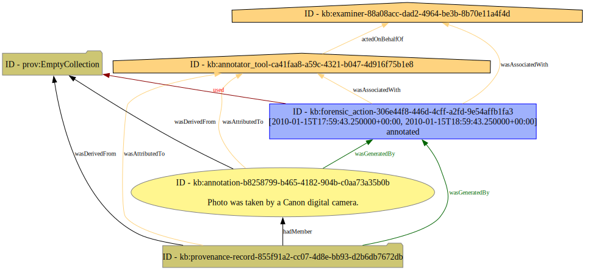
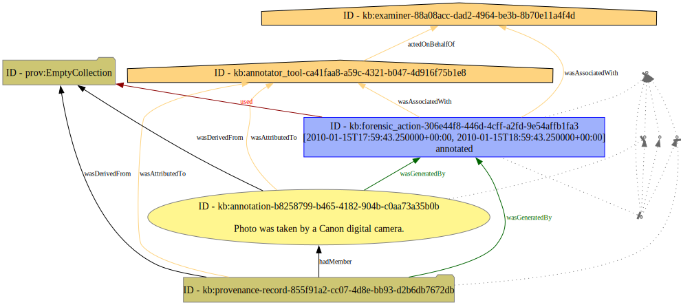
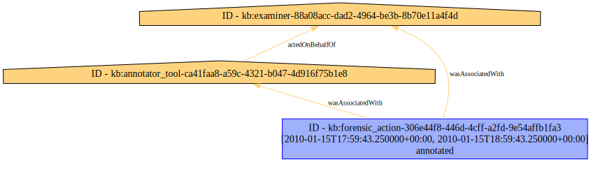
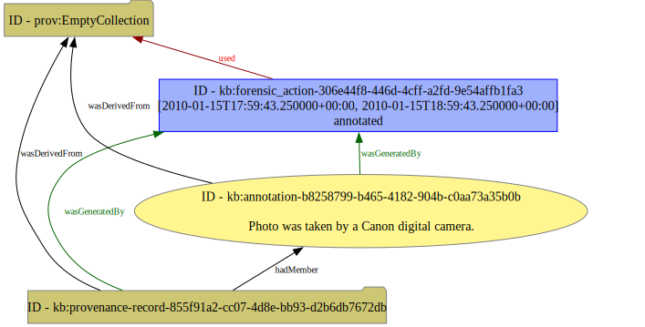
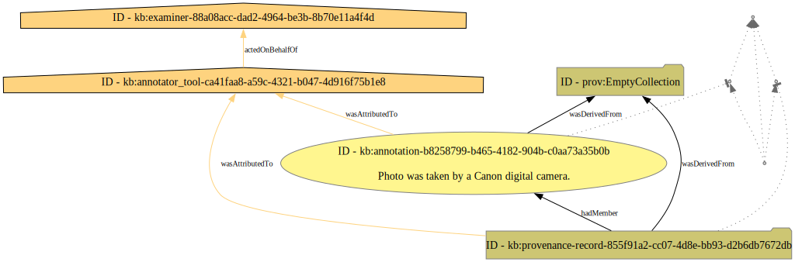

# EXIF Data Example

## Relationship illustrations

Using a proof-of-concept illustration system, a render of this scenario's `uco-core:Relationship` objects is available:

## Provenance illustrations

Following visual-design practices of [PROV-O](https://www.w3.org/TR/prov-o/), the following renders of this scenario's provenance are available:

| Figure's contents | Time hidden | Time displayed |
| --- | --- | --- |
| All |  |  |
| Chains of communication (activities) |  |  |
| Chains of delegation (agents) |  |  |
| Chains of derivation (entities) |  |  |
| Chains of communication and delegation |  |  |
| Chains of communication and derivation |  |  |
| Chains of delegation and derivation |  |  |
