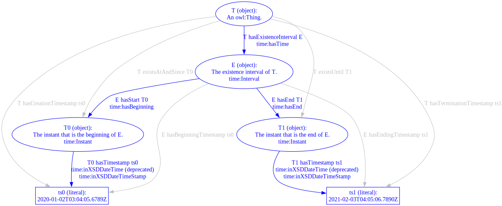
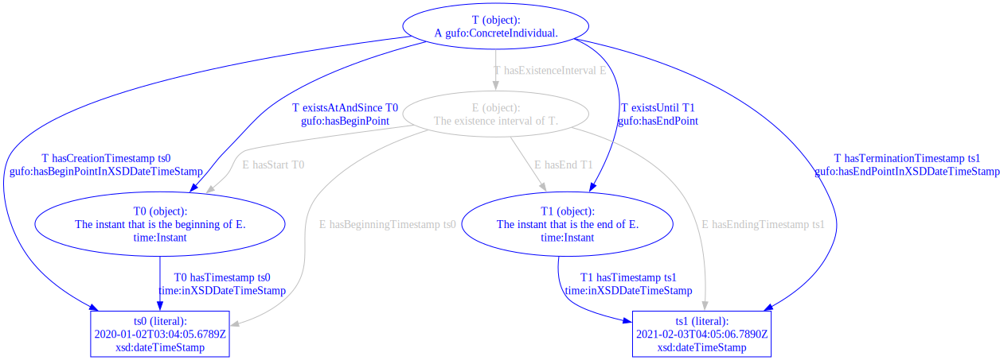

<!-- Look for TODOs. -->

# Existence Intervals

This example demonstrates various ontologies' representations of the period of time in which a thing exists.  Some effort is put into describing differences in representing the existence of endurants vs. perdurants.

Take as an example a thing---and the thing might be endurant, perdurant, physical, cyber, thought, event, etc.---that exists starting at a time `t0` and ceases to exist at a time `t1`.  In the illustrations below, the start will be labeled `t0`, the end `t1`, the interval bounded by start and end `i`, the thing `t`.

The starting time of this thing is `2020-01-02T03:04:05.6789Z`.  The ending time of this thing is `2021-02-03T04:05:06.7890Z`.  Each illustration goes as far as it can with concepts in the referenced ontology to eventually tie the thing `t` to these timestamp-literals.  Where available, reified "instant" objects will be favored over literal-valued properties.


This suggests a mapping table:

| Example class or triple | Corresponding class or triple |
| --- | --- |
| `ex:TimeBoundedThing` | ... |
| `ex:ExistenceInterval` | ... |
| `ex:Instant` | ... |
| `kb:T ex:hasExistenceInterval kb:E` | ... |
| `kb:T ex:existsAtAndSince kb:T0` | ... |
| `kb:T ex:existsUntil kb:T1` | ... |
| `kb:T ex:hasCreationTimestamp "2020-..."^^xsd:dateTime` | ... |
| `kb:T ex:hasTerminationTimestamp "2021-..."^^xsd:dateTime` | ... |
| `kb:E ex:hasStart kb:T0` | ... |
| `kb:E ex:hasEnd kb:T1` | ... |
| `kb:E ex:hasBeginningTimestamp "2020-..."^^xsd:dateTime` | ... |
| `kb:E ex:hasEndingTimestamp "2021-..."^^xsd:dateTime` | ... |
| `kb:T0 ex:hasTimestamp "2020-..."^^xsd:dateTime` | ... |
| `kb:T1 ex:hasTimestamp "2021-..."^^xsd:dateTime` | ... |

The mapping table is filled in for the various ontologies below with:

* Corresponding statements (class IRIs or full triples);
* "N/A", for not-**available** when a concept is known to not be mappable now, typically because no corresponding class or property is currently defined; and
* "TBD", when a design decision can be taken, typically because of a potential class- or property-equality declaration.

Note that "N/A" does not mean that a mapping is not possible.  It only means that classes and properties are not defined at the present moment.

<!--
TODO - Also review whether each ontology states, or otherwise constrains, that an existence interval is unique.  E.g. denote whether an object can recur, such as with some models of relationships.
-->


## UCO 1.3.0

UCO declares two property-pairs setting time boundaries:

* `core:startTime` and `core:endTime`, used to bound `core:Event`s and `core:Relationship`s.
* `action:startTime` and `action:endTime`, used to bound `action:Action`s.

The following table shows the time coverage for the three UCO classes that currently encode constraints on time properties:

| UCO Class | Figure |
| --- | --- |
| `uco-action:Action` |  |
| `uco-core:Event` |  |
| `uco-core:Relationship` |  |

The mapping for `uco-action:Action` would be as follows.

| Example class or triple | Corresponding class or triple |
| --- | --- |
| `ex:TimeBoundedThing` | `uco-action:Action` |
| `ex:ExistenceInterval` | TBD |
| `ex:Instant` | N/A |
| `kb:T ex:hasExistenceInterval kb:E` | TBD |
| `kb:T ex:existsAtAndSince kb:T0` | N/A |
| `kb:T ex:existsUntil kb:T1` | N/A |
| `kb:T ex:hasCreationTimestamp "2020-..."^^xsd:dateTime` | `kb:T uco-action:startTime "2020-..."^^xsd:dateTime` |
| `kb:T ex:hasTerminationTimestamp "2021-..."^^xsd:dateTime` | `kb:T uco-action:endTime "2021-..."^^xsd:dateTime` |
| `kb:E ex:hasStart kb:T0` | N/A |
| `kb:E ex:hasEnd kb:T1` | N/A |
| `kb:E ex:hasBeginningTimestamp "2020-..."^^xsd:dateTime` | TBD |
| `kb:E ex:hasEndingTimestamp "2021-..."^^xsd:dateTime` | TBD |
| `kb:T0 ex:hasTimestamp "2020-..."^^xsd:dateTime` | N/A |
| `kb:T1 ex:hasTimestamp "2021-..."^^xsd:dateTime` | N/A |

`uco-core:Event` and `uco-core:Relationship` will look similar.

The "TBD"s above pertain to a decision UCO can make on how endurants and perdurants relate to time, under discussion [UCO Issue 544](https://github.com/ucoProject/UCO/issues/544).


## OWL-Time

OWL-Time provides the class `time:TemporalEntity`.  Guidance offers options on how to relate time-things (`time:TemporalEntity`) to things that exist in time (like an activity or an object), drawn from [Section 3.1](https://www.w3.org/TR/owl-time/#topology).

> The properties `:hasTemporalDuration`, `:hasBeginning` and `:hasEnd`, together with a fourth generic property `:hasTime`, support the association of temporal information with any temporal entity, such as an activity or event, or other entity. These provide a standard way to attach time information to things, which may be used directly in applications if suitable, or specialized if needed.

The following figure shows the time coverage for the general usage of `time:TemporalEntity`:



The mapping for `time:TemporalEntity` would be as follows.

| Example class or triple | Corresponding class or triple |
| --- | --- |
| `ex:TimeBoundedThing` | `owl:Thing` |
| `ex:ExistenceInterval` | `time:TemporalEntity` |
| `ex:Instant` | `time:Instant` |
| `kb:T ex:hasExistenceInterval kb:E` | `kb:T time:hasTime kb:E` |
| `kb:T ex:existsAtAndSince kb:T0` | N/A |
| `kb:T ex:existsUntil kb:T1` | N/A |
| `kb:T ex:hasCreationTimestamp "2020-..."^^xsd:dateTime` | N/A |
| `kb:T ex:hasTerminationTimestamp "2021-..."^^xsd:dateTime` | N/A |
| `kb:E ex:hasStart kb:T0` | `kb:E time:hasBeginning kb:T0` |
| `kb:E ex:hasEnd kb:T1` | `kb:E time:hasEnd kb:T1` |
| `kb:E ex:hasBeginningTimestamp "2020-..."^^xsd:dateTime` | N/A |
| `kb:E ex:hasEndingTimestamp "2021-..."^^xsd:dateTime` | N/A |
| `kb:T0 ex:hasTimestamp "2020-..."^^xsd:dateTime` | `kb:T0 time:inXSDDateTime "2020-..."^^xsd:dateTime` |
| `kb:T1 ex:hasTimestamp "2021-..."^^xsd:dateTime` | `kb:T1 time:inXSDDateTime "2021-..."^^xsd:dateTime` |

Some of the examples in the OWL-TIME specification include demonstrations of `time:TemporalEntity` that allow for endurants and perdurants as direct subclasses.  Note that the examples section is non-normative.

* [5.4, "iCalendar"](https://www.w3.org/TR/owl-time/#iCal) instantiates the endurant "Abraham Lincoln" (node `_:TE-2`).
* [5.6, "A Use Case for Scheduling"](https://www.w3.org/TR/owl-time/#scheduling) instantiates perdurants some teleconference and some meeting (nodes `ex:telecon` and `ex:meeting`, respectively).
* [5.7, "Alignment of PROV-O with OWL-Time"](https://www.w3.org/TR/owl-time/#time-prov) states that `prov:Activity` and `prov:InstantaneousEvent` can be subclasses of `time:TemporalEntity` and `time:Instant`, respectively.


## gUFO

(gUFO version: [1.0.0](https://github.com/nemo-ufes/gufo/releases/tag/v1.0.0).)

gUFO's topmost class that describes an object that exists in a period of time is "Concrete Individual" (`gufo:ConcreteIndividual`), defined as the disjoint union of "Endurants," "Events," and "Situations."

* `gufo:Endurant` corresponds with UCO Issue 535's "Endurant".
* `gufo:Event` corresponds with UCO Issue 535's "Perdurant".
* `gufo:Situation` is left out of scope of this discussion.

Two properties, "has begin point" and "has end point," assign the first and last instants that any concrete individual exists.  The properties have range `time:Instant`, inheriting the vocabulary and entailing the structures of OWL-Time as described above.

None of the three subclasses of `gufo:ConcreteIndividual` specialize restrictions on those existence-bounding properties.  Hence, without loss of generality, we can review a `gufo:Endurant` and see the same time-related applicability for `gufo:Event`.

This is an endurant (more specifically, a `gufo:Object`) with literal-valued instants describing the creation and termination timestamps TS0 and TS1:

```json
[
    {
        "@id": "kb:Object-bee97e78-8e5e-4ffe-9c2b-28e960f84bbc",
        "@type": "gufo:Object",
        "rdfs:label": "T",
        "rdfs:comment": "A thing with a time-bounded existence.",
        "gufo:hasBeginPointInXSDDateTimeStamp": {
            "@type": "xsd:dateTimeStamp",
            "@value": "2020-01-02T03:04:05.6789Z"
        },
        "gufo:hasEndPointInXSDDateTimeStamp": {
            "@type": "xsd:dateTimeStamp",
            "@value": "2021-02-03T04:05:06.7890Z"
        }
    }
]
```

This is the same endurant with reified instants housing the beginning and end:

```json
[
    {
        "@id": "kb:Object-bee97e78-8e5e-4ffe-9c2b-28e960f84bbc",
        "rdfs:label": "T",
        "gufo:hasBeginPoint": {
            "@id": "kb:Instant-1a250c7b-19c5-4ec4-bed2-d05c9d438e9d",
            "@type": "time:Instant",
            "rdfs:label": "T0",
            "time:inXSDDateTimeStamp": {
                "@type": "xsd:dateTimeStamp",
                "@value": "2020-01-02T03:04:05.6789Z"
            }
        },
        "gufo:hasEndPoint": {
            "@id": "kb:Instant-bbd8741a-4af8-4358-802b-a6fb8a4cf7dc",
            "@type": "time:Instant",
            "rdfs:label": "T1",
            "time:inXSDDateTimeStamp": {
                "@type": "xsd:dateTimeStamp",
                "@value": "2021-02-03T04:05:06.7890Z"
            }
        }
    }
]
```

Intervals of existence do not appear to be defined directly in gUFO.  Also, since only the first and last instant of a concrete individual are specified, it is also not explicit in gUFO whether an individual's interval of existence needs to be continuous.  For instance, a `gufo:Situation` may be seen to hold for a period of time (such as a person being a student in a `gufo:TemporaryInstantiationSituation`), then not hold (e.g., when the person graduates from a school), then hold again (e.g., when the person later enrolls in another school).

Timestamps are constrained to `xsd:dateTimeStamp`, not `xsd:dateTime`, which is consistent with OWL-Time's deprecation of `time:inXSDDateTime`.  For UCO, this would necessitate transcoding `xsd:dateTime` timestamps with a non-OWL, and likely non-SPARQL, mechanism.

The following figure shows the time coverage for `gufo:ConcreteIndividual`, re-using covering vocabulary from OWL-Time above:



The mapping for `gufo:ConcreteIndividual` would be as follows:

| Example class or triple | Corresponding class or triple |
| --- | --- |
| `ex:TimeBoundedThing` | `gufo:ConcreteIndividual` |
| `ex:ExistenceInterval` | N/A |
| `ex:Instant` | `time:Instant` |
| `kb:T ex:hasExistenceInterval kb:E` | N/A |
| `kb:T ex:existsAtAndSince kb:T0` | `gufo:hasBeginPoint` |
| `kb:T ex:existsUntil kb:T1` | `gufo:hasEndPoint` |
| `kb:T ex:hasCreationTimestamp "2020-..."^^xsd:dateTime` | `kb:t gufo:hasBeginPointInXSDDateTimeStamp "2020-..."^^xsd:dateTimeStamp` |
| `kb:T ex:hasTerminationTimestamp "2021-..."^^xsd:dateTime` | `kb:t gufo:hasEndPointInXSDDateTimeStamp "2021-..."^^xsd:dateTimeStamp` |
| `kb:E ex:hasStart kb:T0` | N/A |
| `kb:E ex:hasEnd kb:T1` | N/A |
| `kb:E ex:hasBeginningTimestamp "2020-..."^^xsd:dateTime` | N/A |
| `kb:E ex:hasEndingTimestamp "2021-..."^^xsd:dateTime` | N/A |
| `kb:T0 ex:hasTimestamp "2020-..."^^xsd:dateTime` | `kb:T0 time:inXSDDateTimeStamp "2020-..."^^xsd:dateTimeStamp` |
| `kb:T1 ex:hasTimestamp "2021-..."^^xsd:dateTime` | `kb:T1 time:inXSDDateTimeStamp "2021-..."^^xsd:dateTimeStamp` |

_Aside_: A side-by-side view of the gUFO and OWL-Time coverage show that an ontology importing gUFO and OWL-Time has complete coverage of the existence-intervals concepts suggested on this page.

| OWL-Time | gUFO |
| --- | --- |
|  |  |
