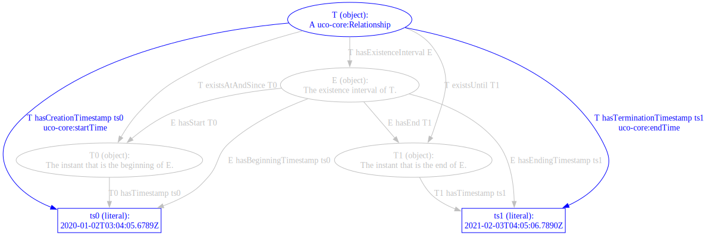

<!-- Look for TODOs. -->

# Existence Intervals

This example demonstrates various ontologies' representations of the period of time in which a thing exists.  Some effort is put into describing differences in representing the existence of endurants vs. perdurants.

Take as an example a thing---and the thing might be endurant, perdurant, physical, cyber, thought, event, etc.---that exists starting at a time `t0` and ceases to exist at a time `t1`.  In the illustrations below, the start will be labeled `t0`, the end `t1`, the interval bounded by start and end `i`, the thing `t`.

The starting time of this thing is `2020-01-02T03:04:05.6789Z`.  The ending time of this thing is `2021-02-03T04:05:06.7890Z`.  Each illustration goes as far as it can with concepts in the referenced ontology to eventually tie the thing `t` to these timestamp-literals.  Where available, reified "instant" objects will be favored over literal-valued properties.

This suggests a mapping table:

| Example class or triple | Corresponding class or triple |
| --- | --- |
| `ex:TimeBoundedThing` | ... |
| `ex:ExistenceInterval` | ... |
| `ex:Instant` | ... |
| `kb:T ex:hasExistenceInterval kb:E` | ... |
| `kb:T ex:existsAtAndSince kb:T0` | ... |
| `kb:T ex:existsUntil kb:T1` | ... |
| `kb:T ex:hasCreationTimestamp "2020-..."^^xsd:dateTime` | ... |
| `kb:T ex:hasTerminationTimestamp "2021-..."^^xsd:dateTime` | ... |
| `kb:E ex:hasStart kb:T0` | ... |
| `kb:E ex:hasEnd kb:T1` | ... |
| `kb:E ex:hasBeginningTimestamp "2020-..."^^xsd:dateTime` | ... |
| `kb:E ex:hasEndingTimestamp "2021-..."^^xsd:dateTime` | ... |
| `kb:T0 ex:hasTimestamp "2020-..."^^xsd:dateTime` | ... |
| `kb:T1 ex:hasTimestamp "2021-..."^^xsd:dateTime` | ... |

The mapping table is filled in for the various ontologies below with:

* Corresponding statements (class IRIs or full triples);
* "N/A", for not-**available** when a concept is known to not be mappable now, typically because no corresponding class or property is currently defined; and
* "TBD", when a design decision can be taken, typically because of a potential class- or property-equality declaration.

Note that "N/A" does not mean that a mapping is not possible.  It only means that classes and properties are not defined at the present moment.

<!--
TODO - Also review whether each ontology states, or otherwise constrains, that an existence interval is unique.  E.g. denote whether an object can recur, such as with some models of relationships.
-->

## UCO 1.3.0

UCO declares two property-pairs setting time boundaries:

* `core:startTime` and `core:endTime`, used to bound `core:Event`s and `core:Relationship`s.
* `action:startTime` and `action:endTime`, used to bound `action:Action`s.

The following table shows the time coverage for the three UCO classes that currently encode constraints on time properties:

| UCO Class | Figure |
| --- | --- |
| `uco-action:Action` |  |
| `uco-core:Event` |  |
| `uco-core:Relationship` |  |

The mapping for `uco-action:Action` would be as follows.

| Example class or triple | Corresponding class or triple |
| --- | --- |
| `ex:TimeBoundedThing` | `uco-action:Action` |
| `ex:ExistenceInterval` | TBD |
| `ex:Instant` | N/A |
| `kb:T ex:hasExistenceInterval kb:E` | TBD |
| `kb:T ex:existsAtAndSince kb:T0` | N/A |
| `kb:T ex:existsUntil kb:T1` | N/A |
| `kb:T ex:hasCreationTimestamp "2020-..."^^xsd:dateTime` | `kb:T uco-action:startTime "2020-..."^^xsd:dateTime` |
| `kb:T ex:hasTerminationTimestamp "2021-..."^^xsd:dateTime` | `kb:T uco-action:endTime "2021-..."^^xsd:dateTime` |
| `kb:E ex:hasStart kb:T0` | N/A |
| `kb:E ex:hasEnd kb:T1` | N/A |
| `kb:E ex:hasBeginningTimestamp "2020-..."^^xsd:dateTime` | TBD |
| `kb:E ex:hasEndingTimestamp "2021-..."^^xsd:dateTime` | TBD |
| `kb:T0 ex:hasTimestamp "2020-..."^^xsd:dateTime` | N/A |
| `kb:T1 ex:hasTimestamp "2021-..."^^xsd:dateTime` | N/A |

`uco-core:Event` and `uco-core:Relationship` will look similar.

The "TBD"s above pertain to a decision UCO can make on how endurants and perdurants relate to time, under discussion [UCO Issue 544](https://github.com/ucoProject/UCO/issues/544).
