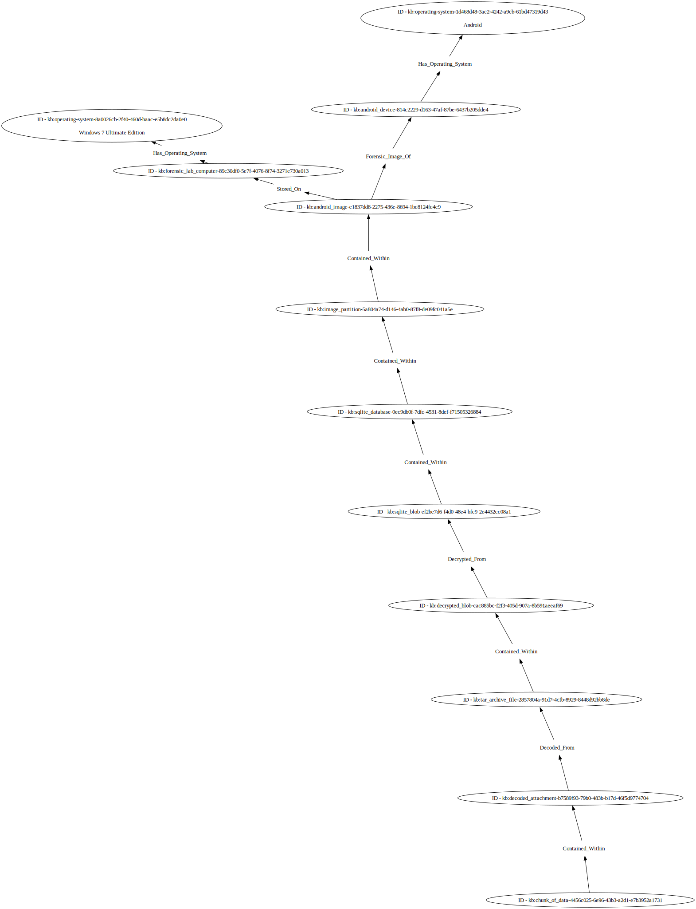

# File Example

*Note: For brevity, all the provenance records and forensic actions are not shown.*

This example shows how files, blocks of data and the relationships between them can be
represented within the CASE ontology. By using a combination of Traces and
Relationship objects it is possible to show the entire extraction of a file no matter the
complexities of how it was stored.

This example shows a block of data that was extracted in the following way:

1. A forensic image `android_image-e1837dd8-2275-436e-8694-1bc8124fc4c9` is taken of an android device `android_device-814c2229-d163-47af-87be-6437b205dde4` and has been stored on an examiner's computer `forensic_lab_computer-89c30df0-5e7f-4076-8f74-3271e730a013`.
1. A disk parition `image_partition-5a804a74-d146-4ab0-87f8-de09fc041a5e` is carved from the image.
1. A SQLite database `sqlite_database-0ec9db0f-7dfc-4531-8def-f71505326884` is extracted from the disk partition.
1. An encrypted SQLite blob `sqlite_blob-ef2be7d6-f4d0-48e4-bfc9-2e4432cc08a1` is extracted from the AttachmentTable of the SQLite database.
1. The SQLite blob is AES decrypted resulting in a TAR archive `decrypted_blob-cac885bc-f2f3-405d-907a-8b591aeeaf69`.
1. A base64 encoded file `tar_archive_file-2857804a-91d7-4cfb-8929-8448d92bb8de` is extracted from the TAR archive.
1. The TAR sub file is base64 decoded resulting in a JPG file `decoded_attachment-b7589f93-79b0-483b-b17d-46f5d9774704`.
1. A particular range of data `chunk_of_data-4456c025-6e96-43b3-a2d1-e7b3952a1731` is extracted from the decoded JPG file.

## Trace objects

The result of each step is represented with a **Trace** object characterizing the data (image, partition, file, database, chunk of data, etc.) that was exposed during the step. 
This Trace object contains property bundles that describe the data itself.

The most used property bundle will be **ContentData**. This property bundle will
contain raw information about the data like byte order, hashes, size, as well
as optionally include the data itself.

Another common property bundle used will be **File**. This property bundle will
contain the file's metadata given to the file by the file system where it was found.

## Relationship objects

The relationship between data resulting from a step and any data known previous to a step is 
represented by a **Relationship** object using one of the special keywords 
(*contained-within*, *decrypted-from*, *decoded-from* or *stored-on*). This object may contain 
property bundles that provide further detail on how the Trace pointed to by the `source` property is related to the Trace pointed to by the `target` property (e.g., where within the target was the source contained).

For the extraction of a file within a file system (EXT4, NTFS, TAR, etc)
we use the property bundle **PathRelation**. This property bundle will contain file path
information needed to extract the file out of the file system.

For encryption steps, we use the **Encryption** property bundle which provide the 
encryption algorithm and parameters that were utilized to decrypt the `target` file. 

For encoding steps, we use the **Encoding** property bundle which provide the 
encoding algorithm used to decode the `target` file.
 
For the extraction of an embedded section of raw bytes within the `target` file, we
use the **DataRange** property bundle which provides the offset location and range size within the `target` file.

## Relationship illustrations

Using a proof-of-concept illustration system, a render of this scenario's `uco-core:Relationship` objects is available:

