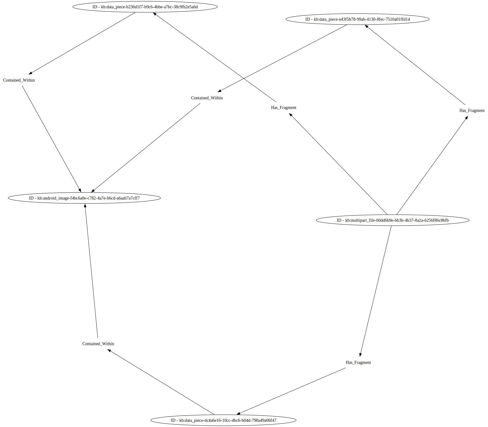

# Multipart File Example

*Note: For brevity, all the provenance records and forensic actions are not shown.*

This example shows how to represent a file that has been fragmented into multiple parts.
This type of file can be things like multipart zip files, reconstructed files, or fragmented
files from memory.

Representing this takes advantage of the same mechanisms used to represent files
that is explained in [*file*](../file/). By using **Relationship** objects with the special keyword *has-fragment*
each fragment of the file can be explicitly associated with the overall file. Each fragment object would then have a **Fragment** property bundle 
that describes the position (*fragmentIndex*) of this particular fragment within the reconstructed file. 
The *totalFragments* property may be used to help the serializer know how many total fragments to look for.

## Relationship illustrations

Using a proof-of-concept illustration system, a render of this scenario's `uco-core:Relationship` objects is available:

