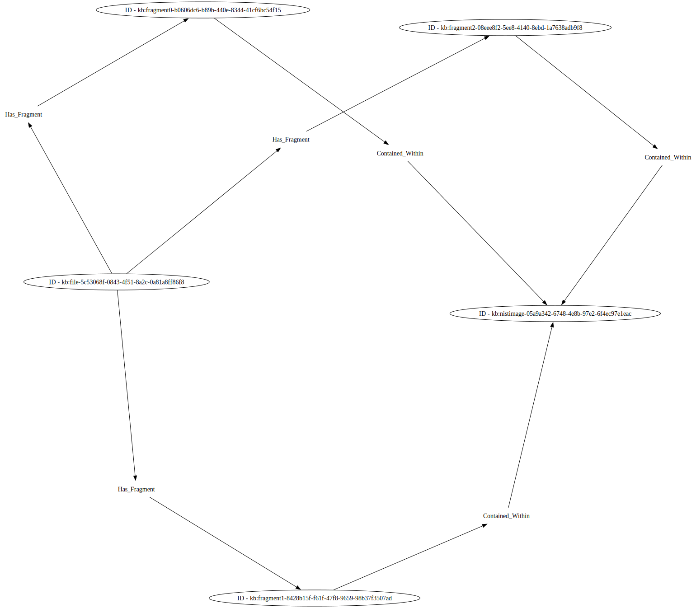

# Reconstructed File Example

This example shows how we can use the mechanisms described by [*file*](../file/) and
[*multipart_file*](../multipart_file/) to define how a file was reconstructed and/or repaired by
data carving software.

The `investigativeaction1` objects in both the `reconstructed_file` and `repaired_file` examples 
describe how the carving tool was run in order to create the provenance records that describe the 
resulting objects created by the tool. The `investigativeaction2` objects describe how the carving
tool combines the carved content to produce the recovered/repaired file.

In both examples, the `provenancerecord1` objects point to the reconstructed/repaired file itself
and the relationships that connect the data fragments to the created file.

The `provenancerecord2` objects points to the carved fragments along with the relationships that describe where 
data pieces where extracted from within the [NIST File Carving image files](https://www.nist.gov/itl/ssd/software-quality-group/computer-forensics-tool-testing-program-cftt/cftt-technical-0). 

In the `repaired_file` example, the `provenancerecord3` object points to the JPG file header (`data_piece0`) that was added
by the carving tool in order to repair and render visible the carved fragment.

### Reconstructed File

The reconstructed file can be extracted using dd as follows:

```
% dd if=graphic-disorder_1305121235.dd bs=512 skip=194527 count=635 > reconstructed_file.jpg
% dd if=graphic-disorder_1305121235.dd bs=512 skip=197069 count=635 >> reconstructed_file.jpg
% dd if=graphic-disorder_1305121235.dd bs=1 skip=99923456 count=975001 >> reconstructed_file.jpg
% shasum -a 256 reconstructed_file 
ee8b9c17c44e128e9e95d60fe219e95feae53c463b01016a312f8c5b732f21de  reconstructed_file.jpg
```


## Relationship illustrations

Using a proof-of-concept illustration system, a render of this scenario's `uco-core:Relationship` objects is available:


